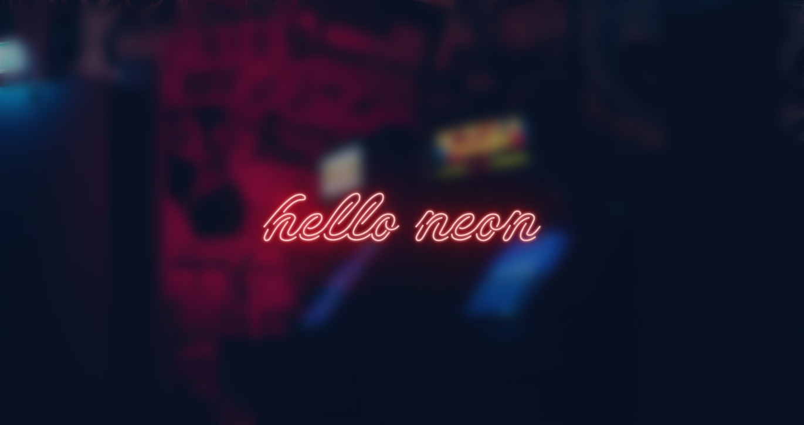
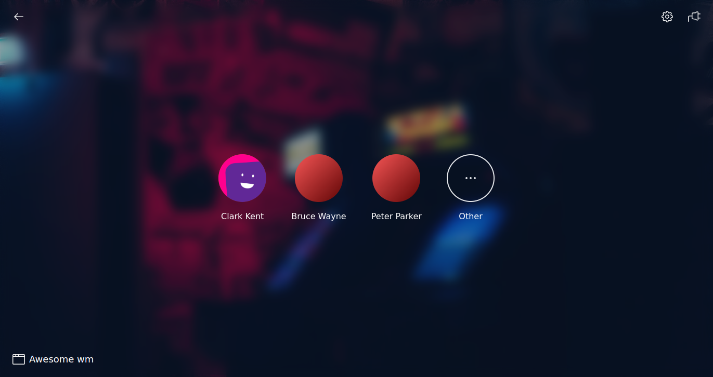
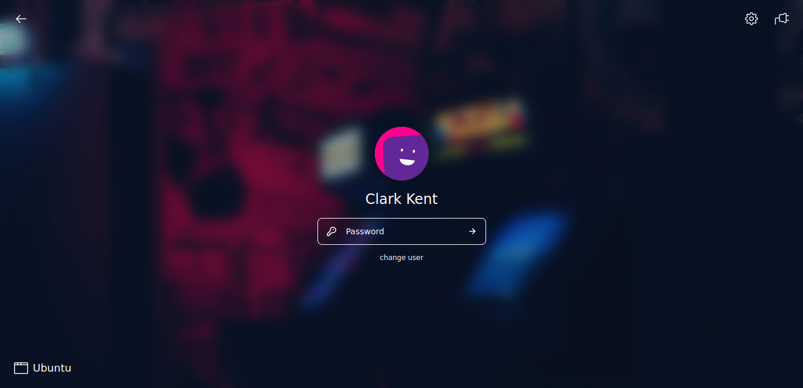
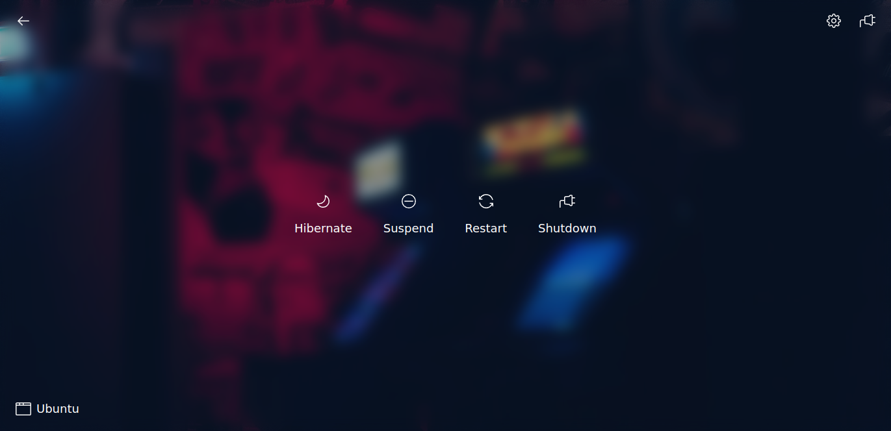

# LightDM Neon Theme
> This theme is developed for [web-greeter](https://github.com/JezerM/web-greeter) / [nody-greeter](https://github.com/JezerM/nody-greeter). The no longer maintained [Antergos/web-greeter](https://github.com/Antergos/web-greeter) is not supported.

## Demo
See a fully functional [live demo](https://hertg.github.io/lightdm-neon/) of the theme.

## Screenshots





## Customize
You can customize the theme to your own preferences.
- enter your own text for the neon sign or simply display a clock
- change the accent color (used for neon sign, user avatar placeholders, ...)
- choose from different fonts for the neon sign
- choose from different background images or use your own
- enable / disable the splashscreen
- and more...

## Build
### Prerequisites
- nodejs (`v16+`)
- npm

### Installation

```sh
npm install
make install
```

### Uninstall
```sh
make uninstall
```

## Contributing
See [CONTRIBUTING.md](https://github.com/hertg/lightdm-neon/blob/main/CONTRIBUTING.md)

## Credits
See [CREDITS.md](https://github.com/hertg/lightdm-neon/blob/main/CREDITS.md)

## Links
- [Building a LightDM Webkit Greeter Theme](https://www.chathandriehuys.com/blog/posts/2021/01/building-a-lightdm-webkit-greeter-theme/) (chathandriehuys.com)
- [lightdm-webkit-theme](https://github.com/cdriehuys/lightdm-webkit-theme) (github.com)
- [lightdm-webkit2-greeter](https://github.com/antergos/web-greeter) (github.com)
- [lightdm-webkit2-theme-reactive](https://github.com/gitneeraj/lightdm-webkit2-theme-reactive) (github.com)
- [nody-greeter](https://github.com/JezerM/nody-greeter)