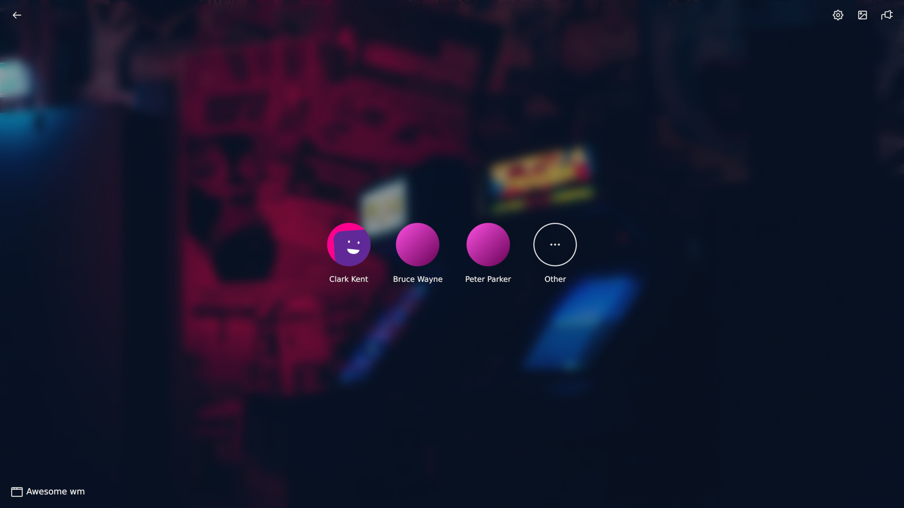
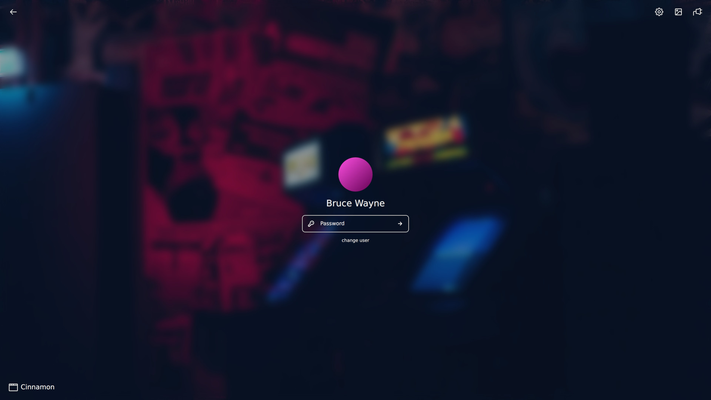

<div align="center">
  <h1><strong>LightDM Neon Theme</strong></h1>
  <p>
    <strong>A modern and customizable theme for <a href="https://github.com/JezerM/web-greeter">web-greeter</a> in a nostalgic neon look</strong>
  </p>
  <p>
    <a href="#">
        
    </a>
    <a href="https://hertg.github.io/lightdm-neon/">
        
    </a>
    <a href="#">
        
    </a>
  </p>
</div>





## Make it your own
You can customize the theme to your own preferences.
- enter your own text for the neon sign or simply display a clock
- change the accent color (used for neon sign, user avatar placeholders, ...)
- choose from different fonts for the neon sign
- choose from different background images or use your own
- enable / disable the splashscreen
- and more...

## Demo
Click here for a fully functional [live demo](https://hertg.github.io/lightdm-neon/) of the theme.

## Installation
### Manual
```sh
git clone https://github.com/hertg/lightdm-neon.git
cd lightdm-neon
make build
sudo make install
```
```sh
sudo make uninstall
```

### AUR
```sh
paru -S lightdm-theme-neon-git
```
> :bulb: [paru](https://github.com/Morganamilo/paru) is an AUR helper written in Rust

## Compatibility
This theme is developed for [web-greeter](https://github.com/JezerM/web-greeter) / [nody-greeter](https://github.com/JezerM/nody-greeter). The no longer maintained [Antergos/web-greeter](https://github.com/Antergos/web-greeter) is not supported.

## Build
### Dependencies
- nodejs (`v16+`)
- npm

### Build
```sh
make build
```

### Installation

```sh
sudo make install
```

### Uninstall
```sh
sudo make uninstall
```

## Contributing
See [CONTRIBUTING.md](https://github.com/hertg/lightdm-neon/blob/main/CONTRIBUTING.md)

## Credits
See [CREDITS.md](https://github.com/hertg/lightdm-neon/blob/main/CREDITS.md)

## Links
- [Building a LightDM Webkit Greeter Theme](https://www.chathandriehuys.com/blog/posts/2021/01/building-a-lightdm-webkit-greeter-theme/) (chathandriehuys.com)
- [lightdm-webkit-theme](https://github.com/cdriehuys/lightdm-webkit-theme) (github.com)
- [lightdm-webkit2-greeter](https://github.com/antergos/web-greeter) (github.com)
- [lightdm-webkit2-theme-reactive](https://github.com/gitneeraj/lightdm-webkit2-theme-reactive) (github.com)
- [nody-greeter](https://github.com/JezerM/nody-greeter)